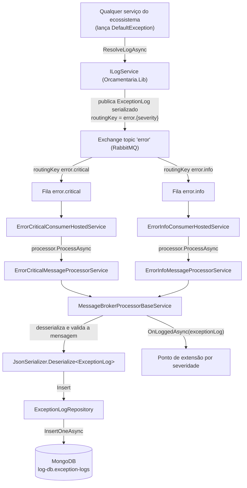
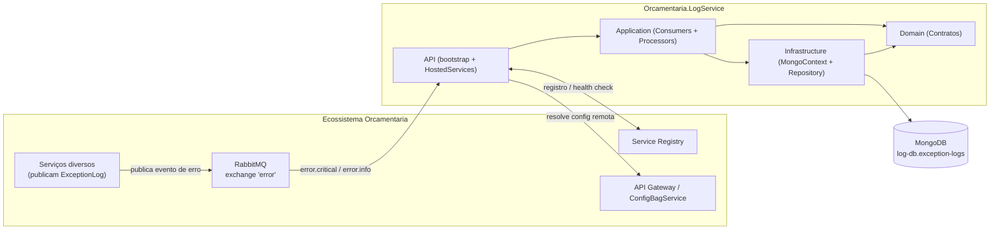
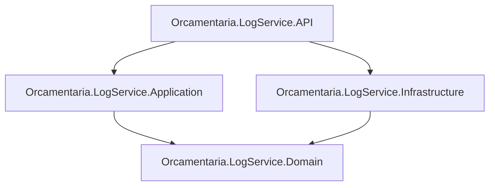

# 📜 Orcamentaria.LogService

Serviço de **centralização de logs de exceção** do ecossistema de microsserviços **Orcamentaria**. Ele consome, via **RabbitMQ**, os eventos de erro publicados por qualquer serviço do ecossistema (Gateway, serviços de negócio, etc.) e os persiste em **MongoDB**, funcionando como o repositório central de auditoria de exceções da plataforma.

---

## 🎯 Objetivo

Na arquitetura Orcamentaria, sempre que uma exceção de negócio (`DefaultException`) ocorre em qualquer serviço — seja em uma requisição HTTP (tratada pelo middleware de erro compartilhado) ou em um processo interno —, o serviço de origem publica um evento estruturado (`ExceptionLog`) no RabbitMQ, em um exchange de tópico chamado `error`, usando uma routing key `error.{severity}` (`error.info`, `error.warning` ou `error.critical`, conforme a severidade da exceção).

O `Orcamentaria.LogService` é o consumidor desses eventos: ele assina as filas `error.critical` e `error.info`, desserializa cada mensagem em um `ExceptionLog` e o grava na coleção `exception-logs` do MongoDB, oferecendo um ponto único e assíncrono de captura de erros de todo o ecossistema, desacoplado dos serviços que os geraram.

O projeto não expõe endpoints HTTP de negócio — a API hospeda apenas os *background workers* de consumo de fila e a infraestrutura comum do ecossistema (Swagger, autenticação, etc.), fornecida pela biblioteca compartilhada `Orcamentaria.Lib`.

---

## 🧰 Tecnologias

| Tecnologia | Versão | Finalidade |
|---|---|---|
| C# / .NET | 9 | Linguagem e runtime da aplicação |
| ASP.NET Core Web API | `Microsoft.NET.Sdk.Web` | Host do processo (background services + infraestrutura comum) |
| `MongoDB.Driver` | 3.5.0 | Persistência dos logs de exceção |
| `MongoDB.Driver.Core` | 2.30.0 | Dependência de baixo nível do driver MongoDB |
| `RabbitMQ.Client` | 7.2.0 | Consumo das filas de eventos de erro |
| `RabbitMQ` | 3.6.2 | Referenciado no projeto API |
| `Microsoft.Extensions.Hosting` | 9.0.11 | Suporte a `BackgroundService` no projeto Application |
| `Orcamentaria.Lib.Domain` | 10.0.8 | Modelos, enums, exceptions e contratos compartilhados do ecossistema |
| `Orcamentaria.Lib.Application` | 2.1.3 | Implementações compartilhadas (RabbitMQ, Service Registry, HTTP client, cache) |
| `Orcamentaria.Lib.Infrastructure` | 5.3.2 | Composição de serviços e middlewares comuns a todos os serviços do ecossistema |
| `Swashbuckle.AspNetCore` | 10.0.1 | Geração de Swagger/OpenAPI (via infraestrutura comum) |

---

## 🏗️ Arquitetura

O projeto segue uma **arquitetura em camadas**, apoiada na biblioteca interna compartilhada `Orcamentaria.Lib`:

- **Domain** (`Orcamentaria.LogService.Domain`): contrato `IExceptionLogRepository`, sem dependência de frameworks de infraestrutura.
- **Application** (`Orcamentaria.LogService.Application`): `BackgroundService`s que consomem as filas RabbitMQ e serviços que processam e persistem cada mensagem recebida.
- **Infrastructure** (`Orcamentaria.LogService.Infrastructure`): contexto de acesso ao MongoDB (`MongoContext`) e implementação do repositório de logs.
- **API** (`Orcamentaria.LogService.API`): composição de injeção de dependência (`Startup.cs`) e bootstrap do host ASP.NET Core, que também mantém ativos os `HostedService`s de consumo.

Fluxo de dependência entre camadas: `API → Application → Domain`, com `Infrastructure` implementando os contratos definidos em `Domain`, sempre apontando para dentro.

---

## 📁 Estrutura do Projeto

```text
Orcamentaria.LogService/
├── Orcamentaria.LogService.API/                 # Composition root / bootstrap do host
│   ├── Program.cs                                #   Cria e executa o host genérico
│   ├── Startup.cs                                #   Registro de serviços e injeção de dependências
│   └── appsettings*.json                         #   Configuração base da aplicação
├── Orcamentaria.LogService.Application/          # Consumo e processamento das mensagens de erro
│   ├── HostedServices/
│   │   ├── ErrorCriticalConsumerHostedService.cs #   Consome a fila "error.critical"
│   │   └── ErrorInfoConsumerHostedService.cs     #   Consome a fila "error.info"
│   └── Services/
│       ├── MessageBrokerProcessorBaseService.cs  #   Desserializa, valida e persiste o ExceptionLog
│       ├── ErrorCriticalMessageProcessorService.cs # Processador específico da fila "error.critical"
│       └── ErrorInfoMessageProcessorService.cs   #   Processador específico da fila "error.info"
├── Orcamentaria.LogService.Domain/               # Contratos
│   └── Repositories/IExceptionLogRepository.cs
├── Orcamentaria.LogService.Infrastructure/       # Acesso a dados
│   ├── Contexts/MongoContext.cs                  #   Coleção "exception-logs" no banco "log-db"
│   └── Repositories/ExceptionLogRepository.cs    #   Implementação de IExceptionLogRepository
└── Orcamentaria.LogService.sln
```

---

## 🔄 Fluxo de Processamento



**Passo a passo:**
1. Qualquer serviço do ecossistema, ao capturar uma `DefaultException` (em uma requisição HTTP ou em um processo interno), chama `ILogService.ResolveLogAsync`, que monta um `ExceptionLog` (tipo, severidade, código, mensagem, origem, local de ocorrência) e o publica no exchange de tópico `error`, com routing key `error.{severity}`.
2. O `Orcamentaria.LogService` mantém dois `BackgroundService`s (`ErrorCriticalConsumerHostedService` e `ErrorInfoConsumerHostedService`), cada um consumindo, respectivamente, as filas `error.critical` e `error.info`.
3. Cada `HostedService` resolve, via injeção de dependência com chave (`AddKeyedScoped`), o `IMessageBrokerProcessorService` correspondente à fila (`ErrorCriticalMessageProcessorService` ou `ErrorInfoMessageProcessorService`).
4. `MessageBrokerProcessorBaseService.ProcessAsync` desserializa a mensagem em um `ExceptionLog`, valida se o conteúdo é válido (lançando `InfoException` em caso de mensagem vazia ou inválida) e insere o registro via `IExceptionLogRepository`.
5. `ExceptionLogRepository.Insert` grava o documento na coleção `exception-logs` do banco `log-db` no MongoDB.
6. Após a persistência, `OnLoggedAsync` é chamado como ponto de extensão — cada processador (`ErrorCriticalMessageProcessorService`/`ErrorInfoMessageProcessorService`) pode implementar um comportamento adicional específico para a severidade da mensagem processada.
7. Em caso de falha no processamento, a exceção é propagada ao consumidor RabbitMQ (`RabbitMqConsumeService`, na `Orcamentaria.Lib`), que faz `nack` da mensagem com `requeue: true`.

---

## 📦 Dependências principais

| Biblioteca | Uso no projeto |
|---|---|
| `Orcamentaria.Lib.Domain` | Modelos `ExceptionLog`, `PlaceException`, `ExceptionOrigin`, enums (`SeverityLevelEnum`, `ErrorCodeEnum`), exceptions de domínio (`InfoException`, `DatabaseException`, `UnexpectedException` etc.). |
| `Orcamentaria.Lib.Application` | `RabbitMqConsumeService` (implementação de `IMessageBrokerConsumerService`), usada pelos `HostedService`s para consumir as filas. |
| `Orcamentaria.Lib.Infrastructure` | `ResolveConfigs`/`ResolveCommonServices`/`ConfigureCommon`, usados em `Startup.cs` para configurar autenticação, Swagger, CORS e a leitura de configuração remota do ecossistema. |
| `MongoDB.Driver` | Cliente MongoDB (`IMongoClient`, `IMongoCollection<ExceptionLog>`) usado por `MongoContext` e `ExceptionLogRepository`. |

---

## ⚙️ Configuração

A aplicação usa o modelo padrão de configuração do ASP.NET Core (`appsettings.json` + `appsettings.{Environment}.json` + variáveis de ambiente), complementado por configuração remota obtida do **ConfigBagService** (via API Gateway) na inicialização.

**`Orcamentaria.LogService.API/appsettings.json`:**
```json
{
  "Logging": {
    "LogLevel": {
      "Default": "Information",
      "Microsoft.AspNetCore": "Warning"
    }
  },
  "ApiGetawayConfiguration": {
    "BaseUrl": "https://localhost:44385"
  }
}
```

- **`ApiGetawayConfiguration.BaseUrl`**: endereço do API Gateway, usado por `ConfigurationBagInitializer` para obter, no bootstrap, a configuração completa do serviço (incluindo `ConnectionStrings:DefaultConnection` para o MongoDB e a seção `MessageBrokerConfiguration` do RabbitMQ) junto ao `ConfigBagService`. Essa configuração remota é mesclada à configuração local antes de `Startup.ConfigureServices` ser executado.
- **`appsettings.json`** também define uma chave usada na obtenção do token de bootstrap necessário para essa consulta inicial ao `ConfigBagService`.
- **`Orcamentaria.LogService.API/appsettings.Development.json`**: contém apenas overrides de `Logging` para o ambiente de desenvolvimento.
- **`MessageBrokerConfiguration`** (`BrokerName`, `Host`, `Port`, `UserName`, `Password`) e **`ConnectionStrings:DefaultConnection`** não aparecem nos arquivos `appsettings*.json` do repositório porque são resolvidos dinamicamente a partir do `ConfigBagService` a cada inicialização do serviço.

---

## 🔑 Variáveis de Ambiente

| Variável | Descrição |
|---|---|
| `ASPNETCORE_ENVIRONMENT` | Define o ambiente ASP.NET Core (default `Development` via `launchSettings.json`). |
| `ApiGetawayConfiguration__BaseUrl` | URL do API Gateway usada para obter a configuração remota do serviço junto ao ConfigBagService (default `https://localhost:44385`). |
| `MessageBrokerConfiguration__Host` / `__Port` / `__UserName` / `__Password` | Conexão com o RabbitMQ, resolvida via configuração remota. |
| `ConnectionStrings__DefaultConnection` | String de conexão do MongoDB, resolvida via configuração remota. |

---

## 🗄️ Banco de Dados

O serviço utiliza **MongoDB** como armazenamento dos logs de exceção:

- **Banco**: `log-db`
- **Coleção**: `exception-logs`
- **Documento**: `ExceptionLog` (`TraceId`, `TraceOrderId`, `Origin`, `Type`, `Severity`, `Code`, `Message`, `Place`, `Date`)

O acesso é feito por `MongoContext` (que expõe `IMongoCollection<ExceptionLog>`) e por `ExceptionLogRepository`, que implementa `IExceptionLogRepository` com operações de inserção (`Insert`) e consultas por serviço, tipo, severidade, código ou intervalo de datas.

---

## ▶️ Como Executar

### Pré-requisitos
- [.NET SDK 9.0](https://dotnet.microsoft.com/download)
- RabbitMQ acessível (local ou remoto)
- MongoDB acessível
- API Gateway e ConfigBagService em execução e acessíveis, para a resolução da configuração remota do serviço no bootstrap

### Passo a passo

```bash
git clone <url-do-repositorio>
cd Orcamentaria.LogService

dotnet restore
dotnet build

dotnet run --project Orcamentaria.LogService.API
```

A API sobe, por padrão, em `http://localhost:5201` (perfil HTTPS: `https://localhost:7215`), abrindo automaticamente o navegador em `/swagger`. Ao iniciar, os `HostedService`s (`ErrorCriticalConsumerHostedService` e `ErrorInfoConsumerHostedService`) passam a consumir as filas `error.critical` e `error.info` em segundo plano.

---

## 🔗 Integrações

| Integração | Descrição |
|---|---|
| **RabbitMQ** | Consumo das filas `error.critical` e `error.info`, alimentadas pelo exchange de tópico `error` a partir de qualquer serviço do ecossistema. |
| **MongoDB** | Persistência dos documentos `ExceptionLog` na coleção `exception-logs` do banco `log-db`. |
| **API Gateway / ConfigBagService** | Resolução da configuração completa do serviço (conexões, credenciais do broker) na inicialização, via `ConfigurationBagInitializer`. |
| **Service Registry** | Registro e *health check* periódico da instância do serviço, via `ServiceRegistryHostedService` (infraestrutura comum). |

---

## 📈 Logs

Logging via `Microsoft.Extensions.Logging`, configurado em `appsettings.json`:

```json
"Logging": {
  "LogLevel": {
    "Default": "Information",
    "Microsoft.AspNetCore": "Warning"
  }
}
```

Além do log de aplicação padrão, o próprio serviço é o destino final dos logs de exceção estruturados (`ExceptionLog`) gerados por toda a plataforma, persistidos no MongoDB.

---

## 🚨 Tratamento de Erros

- Mensagens vazias ou que não puderem ser desserializadas em `ExceptionLog` fazem `MessageBrokerProcessorBaseService` lançar uma `InfoException`.
- Falhas de persistência no MongoDB são encapsuladas em `DatabaseException` por `ExceptionLogRepository`.
- Exceções não mapeadas (`DefaultException`) que ocorram durante o consumo são encapsuladas em `UnexpectedException` pelos `HostedService`s.
- No nível do consumidor RabbitMQ (`RabbitMqConsumeService`, compartilhado via `Orcamentaria.Lib`), qualquer exceção lançada durante `processMessage` resulta em `BasicNackAsync` com `requeue: true`, devolvendo a mensagem para a fila.

---

## 🔐 Segurança

O serviço participa da infraestrutura de autenticação do ecossistema baseada em **JWT (RS256)**, fornecida pela `Orcamentaria.Lib.Infrastructure` (esquemas `userJwt`, `serviceJwt` e `bootstrapJwt`, com chaves públicas RSA embarcadas), embora não exponha atualmente nenhum endpoint HTTP de negócio que exija autorização — sua função é inteiramente orientada a mensageria.

---

## 🧩 Padrões Encontrados

| Padrão | Onde aparece |
|---|---|
| **Dependency Injection** | Serviços e `HostedService`s registrados via `IServiceCollection` e injetados por construtor. |
| **Keyed Services** | `IMessageBrokerProcessorService` é registrado com chaves (`"error.critical"`, `"error.info"`) e resolvido dinamicamente por fila. |
| **Template Method** | `MessageBrokerProcessorBaseService` implementa o fluxo comum de processamento e delega `OnLoggedAsync` às subclasses. |
| **Background Worker** | `ErrorCriticalConsumerHostedService`/`ErrorInfoConsumerHostedService` como `BackgroundService` de consumo contínuo de fila. |
| **Repository** | `IExceptionLogRepository`/`ExceptionLogRepository` isolam o acesso ao MongoDB do restante da aplicação. |

---

## 📊 Diagrama de Arquitetura



---

## 🧱 Dependências entre Módulos



---

## 📝 Resumo Executivo

O **Orcamentaria.LogService** é o serviço de centralização de logs de exceção do ecossistema Orcamentaria, construído em .NET com ASP.NET Core como host de processo. Ele não expõe endpoints HTTP de negócio: sua função é consumir, via RabbitMQ, os eventos `ExceptionLog` publicados pelos demais serviços da plataforma (a partir do exchange de tópico `error`, nas filas `error.critical` e `error.info`) e persisti-los em uma coleção MongoDB (`log-db.exception-logs`).

A solução é organizada em camadas (`API → Application → Domain`, com `Infrastructure` implementando os contratos de `Domain`), apoiada na biblioteca compartilhada `Orcamentaria.Lib`, que fornece o consumidor RabbitMQ, autenticação JWT, Swagger e a resolução de configuração remota do serviço via API Gateway/ConfigBagService. O processamento de cada fila é isolado por classes dedicadas (`ErrorCriticalMessageProcessorService`/`ErrorInfoMessageProcessorService`), que compartilham a lógica de desserialização e persistência através de `MessageBrokerProcessorBaseService` e podem estender o comportamento por severidade via `OnLoggedAsync`.
